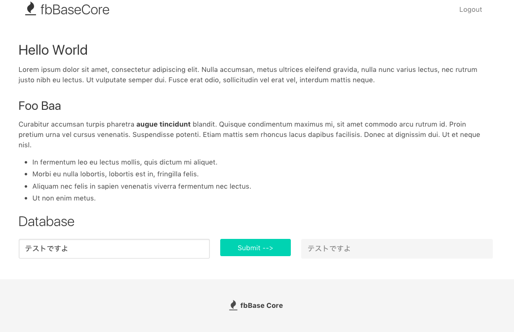
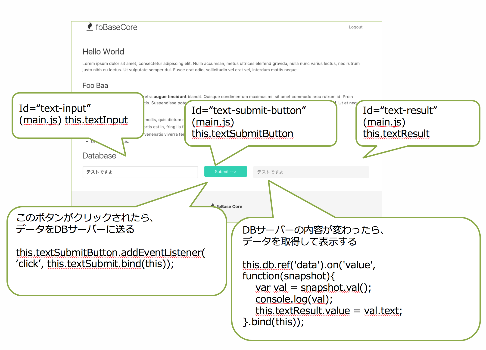

fbDataBase
====

## Database Ruleファイルの確認
database.rules.json
```javascript
{
  "rules": {
    ".read": "auth != null",
    ".write": "auth != null"
  }
}
```
上記の様に変更して下さい。
auth != null は、ログインしていれば許可するという意味です。

## チュートリアル
### HTMLファイルの修正
public/index.htmlを開いて、
<section id="main-section">ブロックの末尾に以下を追加します

```html
<h1 class="title"> Database </h1>
<div class="columns">
  <div class="column is-5">
    <input id="text-input" class="input" type="text" placeholder="Text input">
  </div>
  <div class="column is-2">
    <button id="text-submit-button" type="submit" class="button is-primary is-fullwidth">Submit --&gt;</button>
  </div>
  <div class="column is-5">
    <input id="text-result" class="input" type="text" disabled>
  </div>
</div>
```

以下の様になる
```html
<section id="main-section" class="section" style="display:none;">
  <div class="container">
    <div class="content">
      <h1>Hello World</h1>
      〜中略〜
    </div>

    <h1 class="title"> Database </h1>
    <div class="columns">
      <div class="column is-5">
        <input id="text-input" class="input" type="text" placeholder="Text input">
      </div>
      <div class="column is-2">
        <button id="text-submit-button" type="submit" class="button is-primary is-fullwidth">Submit --&gt;</button>
      </div>
      <div class="column is-5">
        <input id="text-result" class="input" type="text" disabled>
      </div>
    </div>
  </div>

</section>
```

### JSファイルの修正
public/js/main.jsを開いて、
以下の様に修正

```javascript
// Main.prototype.initに追加
Main.prototype.init = function() {
  // code someting here

  // database
  this.textInput = document.getElementById("text-input");
  this.textSubmitButton = document.getElementById("text-submit-button");
  this.textResult = document.getElementById("text-result");

  this.db = firebase.database();
  this.textSubmitButton.addEventListener('click', this.textSubmit.bind(this));
  this.db.ref('data').on('value', function(snapshot){
    var val = snapshot.val();
    console.log(val);
    this.textResult.value = val.text;
  }.bind(this));
};
```

```javascript
// Mani.prototype.initの下に以下を追記
Main.prototype.textSubmit = function(){
  var data = {
    text: this.textInput.value
  };
  this.textSubmitButton.classList.add('is-loading');
  this.db.ref('data').update(data).then(function(){
    this.textSubmitButton.classList.remove('is-loading');
  }.bind(this));
};
```


### ブラウザで確認する
http://localhost:5000 を開いてログインする



- 左側のText Inputに任意のテキストを入力
- Submitボタンを押す
- 右側に入力したテキストが表示される

## 解説
### html
- 左側のText Input：id = "text-input"
- 真ん中のボタン： id = "text-submit-button"
- 右側の表示領域： id = "text-result"
左側に入力したものを右に出すチュートリアル

### javascript

```javascript
  // text-inputの入力ボックス
  this.textInput = document.getElementById("text-input");
  // ボタンオブジェクト
  this.textSubmitButton = document.getElementById("text-submit-button");
  // 結果表示領域オブジェクト
  this.textResult = document.getElementById("text-result");

  // データベース取得
  this.db = firebase.database();

  // ボタンを押されたら、this.textSubmitという関数を呼ぶという設定
  this.textSubmitButton.addEventListener('click', this.textSubmit.bind(this));

  // データベースに変更があったら、表示領域に書き換えるという設定
  this.db.ref('data').on('value', function(snapshot){
    // snapshot.val()にデータの中身が入っている
    var val = snapshot.val();
    // console.logはブラウザでログを表示するための方法
    console.log(val);
    // 結果表示領域に、データベースから取得されたデータを入力する
    this.textResult.value = val.text;
  }.bind(this));
};
```

```javascript
// データをサーバーに送るための関数
Main.prototype.textSubmit = function(){
  // サーバーに保存するデータを彫ってい
  var data = {
    text: this.textInput.value
  };
  // 登録ボタンを一時的にローディングアイコンを表示する
  this.textSubmitButton.classList.add('is-loading');

  // データベースにデータを送信する
  this.db.ref('data').update(data).then(function(){
    // 送信出来たら、登録ボタンのローディングアイコンを取り除く
    this.textSubmitButton.classList.remove('is-loading');
  }.bind(this));
};

```

### まとめ


